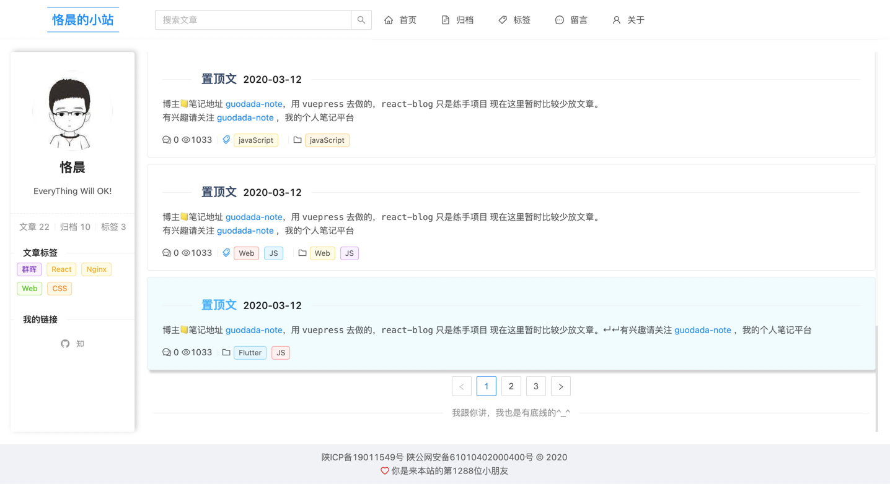
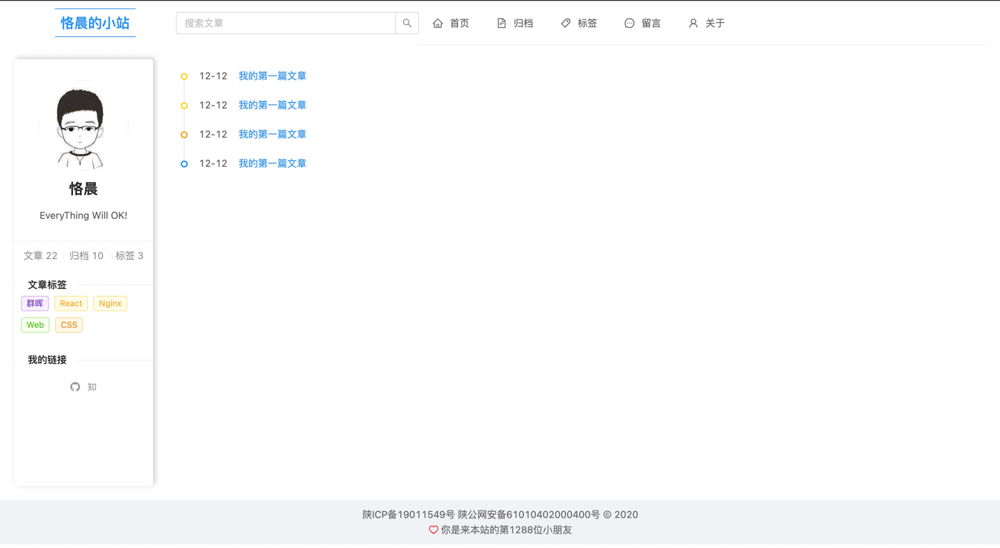
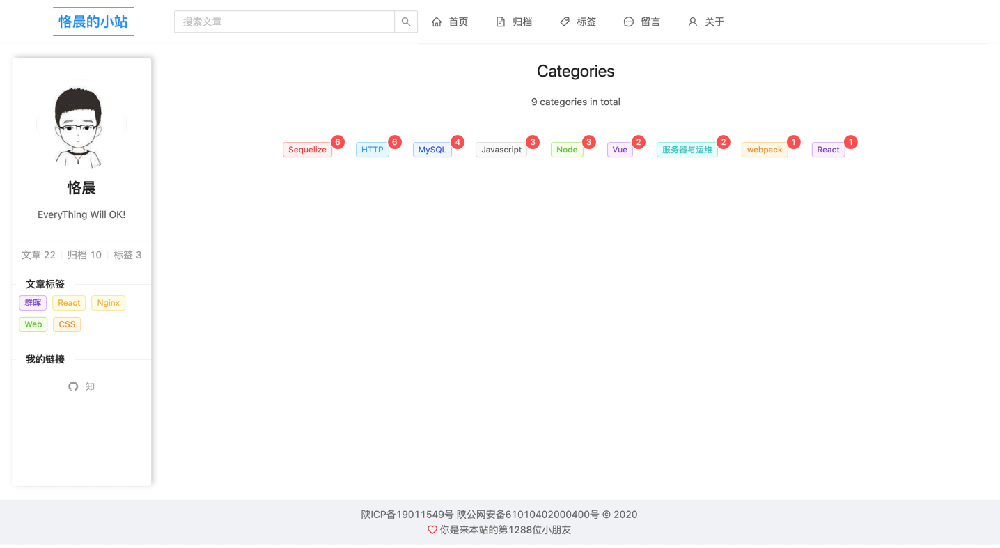
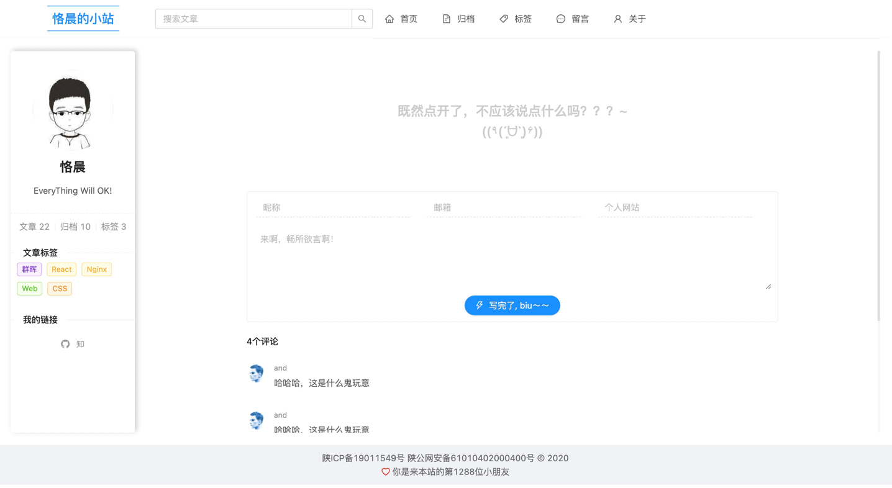
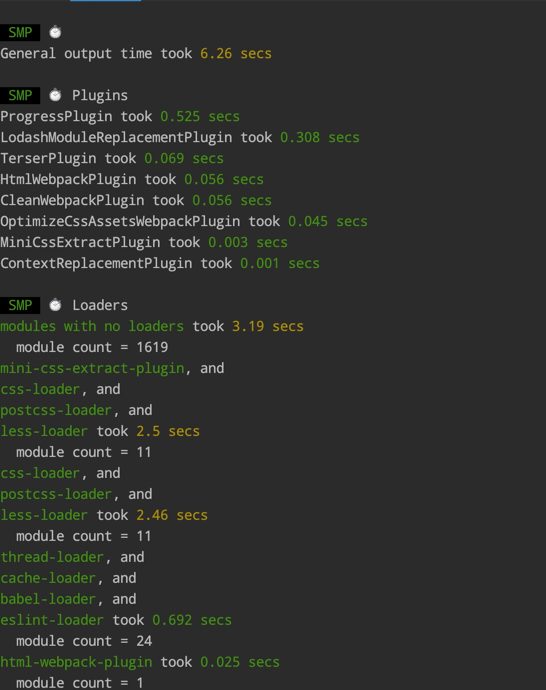
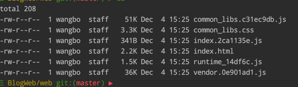

<h1 align="center">Welcome to blogweb 👋</h1>
<p>
  
</p>

### 博客前端项目模版

> 这是一个博客的模版项目，使用了React + Mobx + react-router + Ant Design技术

### 🏠 [Homepage](https://github.com/BoWang816/blogWeb)

### ✨ [Demo](https://web.wangboweb.ml)

## Install

```sh
npm install
```

## Usage

```sh
npm run start
```

## view
```html
http://localhost:3000
```

## build
```sh
npm run build
```

## Author

👤 **bo.wang**

* Website: https://bowang816.github.io
* Github: [@Bowang816](https://github.com/Bowang816)

## 🤝 Contributing

Contributions, issues and feature requests are welcome!<br />Feel free to check [issues page](https://github.com/BoWang816/blogWeb/issues). You can also take a look at the [contributing guide](http://gitlab.platdep.shuyun.com/fe/fe-c/ccms-benefit-mamage-react/blob/master/CONTRIBUTING.md).

## Show your support

Give a ⭐️ if this project helped you!

***
_This README was generated with ❤️ by [readme-md-generator](https://github.com/kefranabg/readme-md-generator)_


### 首页


### 归档


### 标签


### 留言板


### 打包速度


### 打包大小

